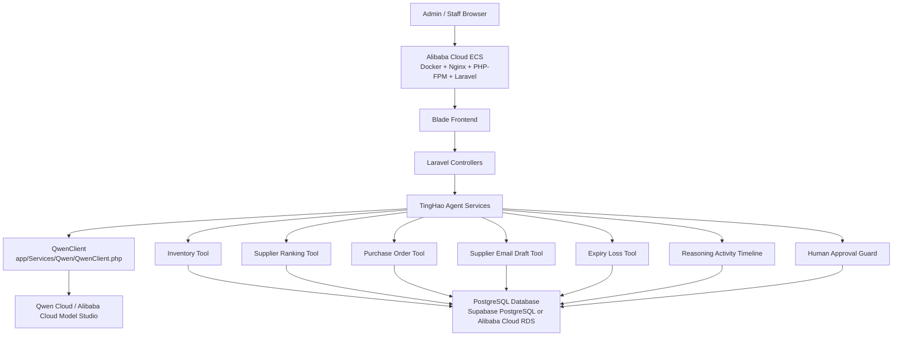

# TingHao Agent Architecture

Last updated: 2026-06-29

TingHao Agent is a Laravel full-stack application. Blade views are the frontend, Laravel controllers/services are the backend, and Qwen Cloud is called only from server-side Laravel code.

## Deployment Shape



## Core Rules

- Frontend and backend live in the same Laravel application.
- Blade renders UI; no separate frontend app is required.
- Qwen API keys are read from environment variables and never sent to Blade or JavaScript.
- `QwenClient` calls Qwen Cloud / Alibaba Cloud Model Studio server-side only.
- Laravel executes real business actions through internal tools and Eloquent models.
- Human approval is required before critical actions such as PO approval, supplier email approval, expiry recommendation completion, expired stock removal, and PO receiving.
- Reasoning Activity stores concise summaries, evidence, confidence, risk labels, and human checkpoints. It does not expose raw chain-of-thought.

## Agent Workflow

```text
Smart Procurement Inbox
  -> AgentController
  -> TingHaoAgentService
  -> ProcurementMessageParserService
  -> QwenClient or mock fallback
  -> InventoryLookupToolService
  -> RestockPlanningService
  -> SupplierRankingService
  -> PurchaseOrderDraftService
  -> ApprovalRequest
  -> SupplierEmailDraftService after admin approval
  -> ReasoningActivityService and AgentToolCall audit logs
```

## Expiry Loss Workflow

```text
Dashboard or /agent/expiry-loss
  -> ExpiryLossRecommendationController
  -> ExpiryLossPreventionService
  -> Query ingredients expiring within 7 days
  -> Calculate potential RM loss from real quantity and cost
  -> QwenClient or mock fallback for practical recommendation
  -> Save expiry_loss_recommendations
  -> Show RM impact and human-review actions
```

## Proof Endpoints

- `/health` returns safe service, architecture, database, Qwen configuration, and mock-mode status.
- `/agent/proof` returns safe hackathon proof metadata for Alibaba Cloud ECS and server-side Qwen use.
- Neither endpoint exposes API keys, database credentials, or secret environment values.
